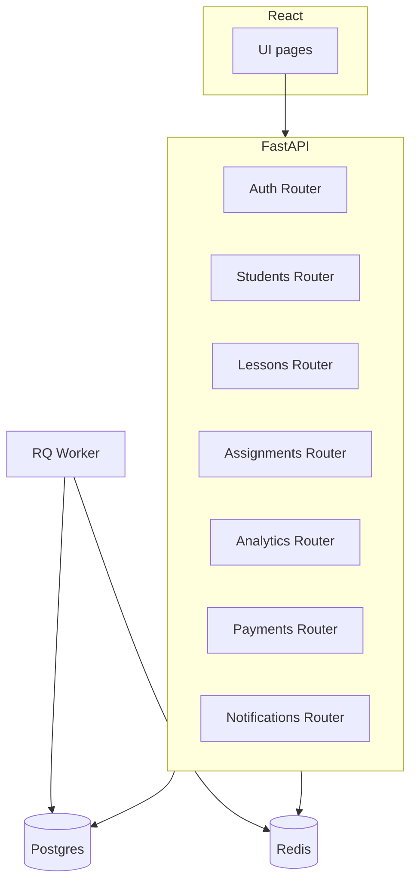
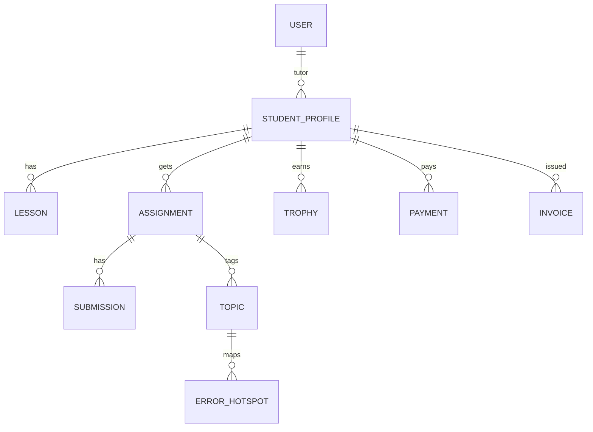

# Hermes MVP

> Мини-сервис-органайзер для частного репетитора: учёт учеников, уроков, ДЗ-квестов, аналитики и оплат.

---

## ✨ Возможности

- **Ученики**: профили, биография, аватар-герой, трофеи.  
- **Уроки**: календарь-мозаика с карточками.  
- **Домашка**: задания как квесты (награды: монетки, бейджи).  
- **Аналитика**: теплокарта ошибок, «радар внимания», прогноз экзамена.  
- **Финансы**: инвойсы, оплаты, напоминания.  
- **Геймификация**: мемы, турниры, достижения.  
- **Уведомления**: email через MailHog.  

---

## 🛠️ Стек

- **Backend**: Python 3.11, FastAPI, SQLAlchemy, Alembic, RQ (Redis).  
- **Frontend**: React 18, Vite, TailwindCSS, React Router.  
- **DB**: PostgreSQL 15.  
- **Cache/Jobs**: Redis 7.  
- **Infra**: Docker, docker-compose.  
- **Mail**: MailHog (SMTP sandbox).  
- **Мониторинг**: JSON-логи, Prometheus-метрики, rate-limit.  

---

## 🚀 Запуск проекта

### 1. Подготовка

- Установите Docker и docker-compose.  
- Склонируйте репозиторий.  
- Скопируйте `.env.sample` → `.env` (по умолчанию достаточно стандартных значений).

### 2. Поднять окружение

```bash
make up
```

### 3. Применить миграции

```bash
make migrate
```

### 4. Засеять данные

```bash
make seed        # базовые фикстуры (пользователь-репетитор, 3 ученика)
make seed2       # доп. сиды (темы, аватары, мемы, турнир)
make seed_lessons # тестовые уроки для календаря
```

### 5. Проверка

- API: http://localhost:8000  
- Swagger: http://localhost:8000/docs  
- Метрики: http://localhost:8000/metrics  
- Web (React): http://localhost:5173  
- Почта (MailHog UI): http://localhost:8025  

---

## 📂 Структура проекта

```text
api/
  ├── main.py             # Точка входа FastAPI
  ├── models.py           # SQLAlchemy ORM
  ├── routers/            # Маршруты API (auth, students, lessons, ...)
  ├── scripts/            # seed.py, seed_stage2.py, seed_lessons.py
  ├── alembic/            # миграции
  ├── metrics.py          # Prometheus middleware
  └── logging_config.py   # JSON-логи + correlation-id

web/
  ├── src/
  │   ├── App.tsx         # Маршрутизация фронта
  │   ├── pages/          # Страницы (Dashboard, Finance, Heatmap, ...)
  │   └── components/     # Общие компоненты
  ├── index.html
  └── package.json
```

---

## 📊 UML-Диаграммы

### Архитектура модулей



### ER-Диаграмма (основные таблицы)



---

## 🔌 Примеры API

### Создать ученика

```bash
curl -X POST http://localhost:8000/students   -H "Content-Type: application/json"   -d '{"name": "Иван Петров"}'
```

### Создать урок

```bash
curl -X POST http://localhost:8000/lessons   -H "Content-Type: application/json"   -d '{"student_id": 1, "date": "2025-09-30T12:00:00", "topic": "Интегралы"}'
```

### Выдать ДЗ

```bash
curl -X POST http://localhost:8000/assignments   -H "Content-Type: application/json"   -d '{"student_id": 1, "title": "Задачи на производные", "reward_type": "star"}'
```

---

## 🧪 Тесты

```bash
make test
```

- `test_smoke.py` — базовые проверки Stage 0–1.  
- `test_stage2.py` — биография, аватары, финансы, аналитика.  

---

## 🔐 Безопасность и приватность

- RBAC: `tutor | student | parent` (базовые права).  
- JSON-логи с `X-Request-ID`.  
- Rate-limit 5rps/IP (кроме `/health`, `/metrics`).  
- GDPR-лайт: экспорт/удаление по запросу (TODO).  
- A11y: поддержка контраста, aria-метки.  

---

## 🗺️ Roadmap

- [x] Stage 0 — база (auth, students, lessons, assignments).  
- [x] Stage 1 — дашборд, ДЗ-квесты, отчёт родителям.  
- [x] Stage 2 — биография, аватары, финансы, календарь.  
- [ ] Stage 3 — реальный чат-бот ассистент.  
- [ ] Stage 4 — интеграция реальных платежей (Stripe/YooKassa).  

---

## 📸 Скриншоты (TODO)

- Дашборд  
- Календарь  
- Финансы  
- Биография ученика  

---

## 🤝 Контрибьютинг

- PR welcome.  
- Линтер: `make lint`, формат: `make fmt`.  
- Тесты: `make test`.  

---

## 📜 Лицензия

MIT (или иная, на выбор).
