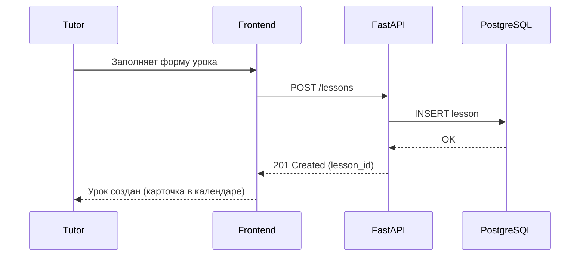
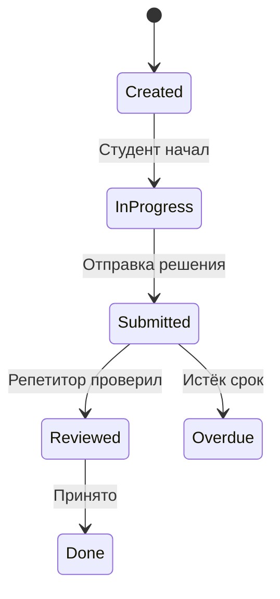
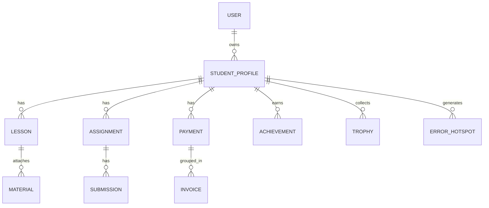
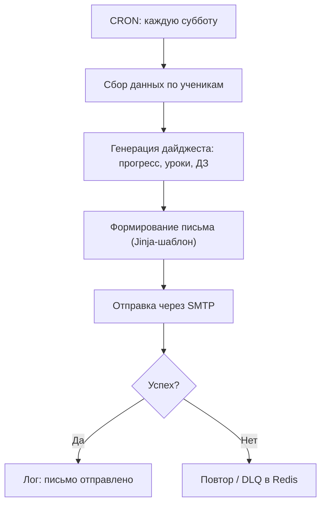

# Hermes MVP — образовательный сервис-органайзер для частного репетитора

Минимальный рабочий продукт (MVP) на **FastAPI + React**, разворачиваемый через Docker Compose.

---

## 🚀 Возможности

- **Панель репетитора**
  - Дашборд с графиками прогресса.
  - Радар внимания (приоритизация учеников).
  - Календарь-мозаика (уроки как карточки).
- **Профиль ученика**
  - Герой-аватар, уровень = прогресс.
  - Биография, цели, тепловая карта ошибок.
  - Лента достижений.
- **Учёт уроков и материалов**
  - Трекер занятий.
  - Автобиблиотека материалов.
- **Домашка как квест**
  - Чек-листы, награды, статусы.
- **Финансовый модуль**
  - Учёт оплат, статусы, напоминания.
- **Уведомления**
  - Еженедельный дайджест родителям.
  - Напоминания о ДЗ, уроках и оплате.

---

## 📂 Структура проекта

```
.
├─ api/               # Backend (FastAPI)
│  ├─ main.py
│  ├─ models.py
│  ├─ routers/
│  ├─ alembic/
│  ├─ scripts/
│  └─ tests/
├─ web/               # Frontend (React + Vite)
│  └─ src/pages/
├─ docker-compose.yml
├─ Makefile
├─ .env.sample
└─ pyproject.toml (или requirements.txt)
```

---

## 🛠️ Установка и запуск

### 1. Клонирование и подготовка
```bash
git clone https://github.com/ArtemLevin/Hermes.git
cd Hermes
cp .env.sample .env
```

### 2. Запуск контейнеров
```bash
make up
make migrate
make seed
```

### 3. Доступы
- **Backend (Swagger/OpenAPI):** http://localhost:8000/docs  
- **Frontend (React):** http://localhost:5173/  
- **Mailhog (тест почты):** http://localhost:8025/  

Демо-логин:  
```
email: tutor@example.com
pass:  tutor
```

---

## 📊 UML-диаграммы

### Процесс: Создание урока


### Состояния задания (ДЗ)


### Схема БД (ключевые таблицы)


### Активность: Еженедельный отчёт родителям


---

## 🔧 Команды Makefile

- `make up` — собрать и поднять контейнеры.  
- `make down` — остановить и удалить контейнеры/volumes.  
- `make migrate` — применить Alembic миграции.  
- `make seed` — загрузить тестовые данные.  
- `make smoke` — прогнать быстрый smoke-тест API.  

---

## ✅ Критерии приёмки (DoD)

- Поднимается `docker-compose up` → Swagger и Frontend доступны.  
- Можно: зарегистрировать ученика, создать урок, выдать ДЗ, получить письмо в Mailhog.  
- Основные API отвечают <200 мс на dev-стенде.  
- Линтер + тесты проходят:  
  ```bash
  ruff check api
  pytest -q
  ```

---

## 📌 Дальнейшая доработка

- Метрики (Prometheus/Grafana).  
- Радар внимания и прогноз экзамена.  
- Турниры, мемы и чат-бот-ассистент.  
- Экспорт PDF отчётов для родителей.  
